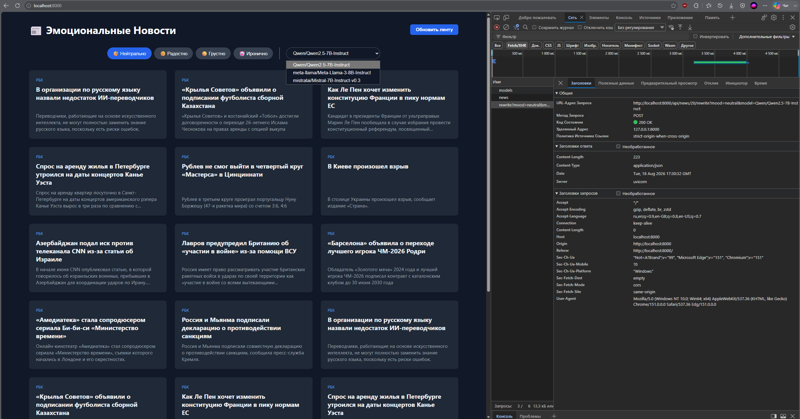
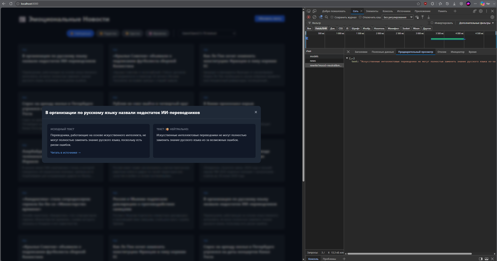

```markdown
# 📰 Эмоциональные Новости (News Emotions)

Приложение берет реальные новости из открытых источников (RSS-ленты РБК) и переписывает их под выбранный эмоциональный настрой с помощью нейросетей. Факты при этом строго сохраняются.

## ✨ Основные возможности
- **Парсинг реальных новостей:** Получение свежих новостей из открытого RSS-источника (РБК).
- **Грид-отображение:** Удобная сетка карточек с превью новостей.
- **Переключатель настроения:** 4 режима генерации (🧐 Нейтрально, 😊 Радостно, 😢 Грустно, 🤡 Иронично).
- **Сравнение текстов:** При клике на новость открывается модальное окно, где исходный текст и переписанный расположены рядом.
- **Выбор AI-модели:** Выпадающий список с доступными моделями на Hugging Face.
- **Ссылка на источник:** Каждая новость содержит кликабельную ссылку на оригинальную статью.
- **Кэширование:** Сгенерированные тексты сохраняются в БД для мгновенного отображения при повторном открытии.

## 🛠 Технологический стек
- **Backend:** Python, FastAPI
- **Frontend:** HTML, CSS (кастомный), Vanilla JS
- **База данных:** SQLite (встроенная)
- **Парсинг:** `httpx`, `xml.etree.ElementTree`, `BeautifulSoup`
- **AI-движок:** Hugging Face Inference API (модели Qwen, Mistral)

## ⚙️ Как контролировались факты (Важно!)

Для выполнения требования *"сохранить факты: имена, даты, числа, места, цитаты"* и *"не выдумывать новости"* реализован следующий механизм:

1. **Жесткий системный промпт (System Prompt):** 
   Нейросети передается строгая инструкция-роль: *"Ты профессиональный редактор. СТРОГИЕ ПРАВИЛА: НЕЛЬЗЯ менять имена, фамилии, названия компаний, цифры, даты, суммы и места. НЕЛЬЗЯ добавлять новые факты или выдумывать события, которых нет в исходном тексте. Разрешено менять только прилагательные, наречия и структуру предложений"*.
2. **Параметр `temperature = 0.2`:** 
   В API-запросе устанавливается низкая температура генерации. Это делает ответы модели максимально детерминированными, снижая риск "галлюцинаций" и выдумывания новых фактов.
3. **Изолированный ввод:** 
   В модель отправляется только очищенный текст конкретной новости без доступа к интернету или другим контекстам, что исключает влияние внешней информации.
```

## 🚀 Установка и запуск

### 1. Клонирование репозитория
```bash
git clone <url_вашего_репозитория>
cd news_emotions
```

### 2. Создание виртуального окружения и установка зависимостей
```bash
python -m venv venv
# Для Windows:
venv\Scripts\activate
# Для macOS/Linux:
source venv/bin/activate

pip install -r requirements.txt
```

### 3. Настройка API-ключа
Получите бесплатный токен на [Hugging Face Settings -> Access Tokens](https://huggingface.co/settings/tokens) (тип токена: Read). Используйте токен в файле `.env`:
```env
HF_API_KEY=hf_ваш_токен_здесь
```

### 4. Запуск приложения
```bash
python main.py
```
Откройте браузер и перейдите по адресу: **[http://localhost:8000](http://localhost:8000)**

При первом запуске приложение автоматически спарсит 10 свежих новостей и сохранит их в базу данных `news.db`. Для обновления ленты используйте кнопку "Обновить ленту" в правом верхнем углу.

## 📁 Структура проекта
```text
news_emotions/
├── main.py             # Точка входа FastAPI, маршруты
├── database.py         # Логика работы с SQLite
├── scraper.py          # Парсер RSS-ленты РБК
├── ai_service.py       # Взаимодействие с Hugging Face API
├── requirements.txt    # Зависимости Python
├── .env.example        # Пример файла с API-ключом
└── static/
    ├── index.html      # Разметка страницы
    ├── style.css       # Стили (темная тема)
    └── app.js          # Логика фронтенда (запросы, модалки)
```

## 📸 Скриншоты интерфейса

### Главный экран (Сетка новостей)


### Окно сравнения текстов (Оригинал vs Переписанный)
